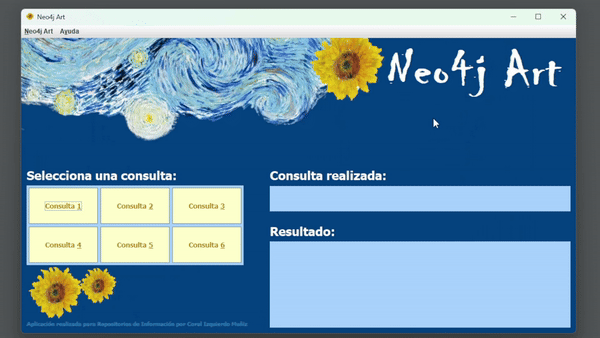
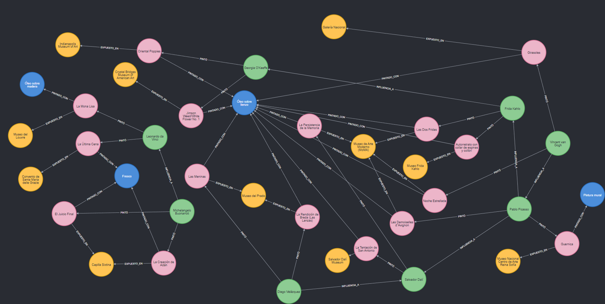
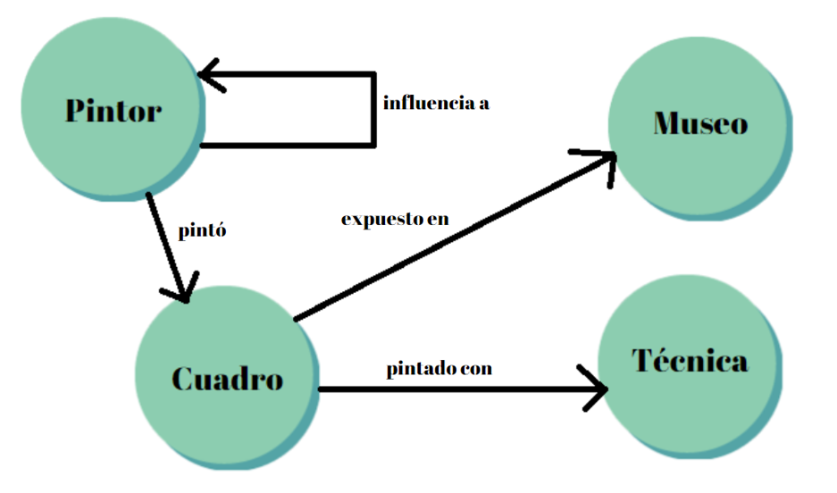

# Neo4jArt (Cypher y Neo4j)

- [Neo4jArt (Cypher y Neo4j)](#neo4jart-cypher-y-neo4j)
  - [English](#english)
    - [Queries](#queries)
    - [Configuration](#configuration)
    - [Documentation on GraphGist](#documentation-on-graphgist)
  - [Español](#español)
    - [Consultas](#consultas)
    - [Configuración](#configuración)
    - [Documentación en GraphGist](#documentación-en-graphgist)
    - [Info](#info)



## English
Neo4jArt is a Java project that uses a Neo4j graph database on the AuraDB platform using the Cypher query language. Its main theme is art and represents the different relationships between painters, paintings, museums and artistic techniques.





### Queries
1. Obtain all the pictures painted by an artist.
2. Obtain all the painters who used a particular technique.
3. Obtain the techniques that have been used in more than 5 works.
4. Obtain the pictures painted by an artist who has influenced another painter.
5. Obtain the influences between painters (transitive closure).
6. Obtain the painter who has influenced other painters the most.


### Configuration
In order to run the application correctly, the following steps must be followed:
1. You need to create an instance in [Neo4j AuraDB](https://neo4j.com/cloud/platform/aura-graph-database/).
2. Inside the **Browser** tab, paste the script written in Cypher from this repository [CreateDataBase.txt](https://github.com/coral2742/Neo4jArt/blob/main/neo4j-art/src/main/resources/scripts/CreateDataBase.txt) to create the nodes and relations in graph form and represent the painters, paintings, artistic techniques, museums and the relations between them.
3. Within the Java project, a Credentials class must be created with the **URI** of the AuraDB instance, the **user** and **password**. Next I show an example template:
```java
package queries;

public class Credentials {
	
	private static final String URI = "neo4j+s://<URI>.databases.neo4j.io";
	private static final String user = "<User>";
	private static final String password = "<Password>";
	
	
	public static String getURI() {
		return URI;
	}


	public static String getUser() {
		return user;
	}


	public static String getPassword() {
		return password;
	}

}
```

### Documentation on GraphGist
Documentation is provided in GraphGist format:
[Neo4jArt on GraphGist](https://portal.graphgist.org/graph_gists/5599009c-169c-430d-917e-12d51fabc261)


## Español
Neo4jArt es un proyecto en Java que utiliza una base de datos de grafo Neo4j en la plataforma AuraDB utilizando el lenguaje de consulta Cypher. Su temática principal es el arte y representa diferentes relaciones entre pintores, cuadros, museos y técnicas artísticas.


### Consultas
1. Obtener todos los cuadros pintados por un artista
2. Obtener todos los pintores que utilizaron una técnica concreta
3. Obtener las técnicas que han sido utilizadas en más de 5 obras
4. Obtener los cuadros pintados por un artistas que haya influido en otro pintor
5. Obtener las influencias entre pintores (cierre transitivo)
6. Obtener el pintor que más haya influido en otros pintores


### Configuración
Para poder ejecutar la aplicación correctamente, se deben seguir los siguientes pasos:
1. Se necesita crear una instancia en [Neo4j AuraDB](https://neo4j.com/cloud/platform/aura-graph-database/).
2. Dentro de la pestaña **Browser**, pegar el script escrito en Cypher de este repositorio [CreateDataBase.txt](https://github.com/coral2742/Neo4jArt/blob/main/neo4j-art/src/main/resources/scripts/CreateDataBase.txt) para crear los nodos y relaciones en forma de grafo y representar los pintores, cuadros, técnicas artísticas, museos y las relaciones entre ellos.
3. Dentro del proyecto Java, se debe crear una clase Credentials con la **URI** de la instancia de AuraDB, el **usuario** y **contraseña**. A continuación muestro una plantilla de ejemplo:

```java
package queries;

public class Credentials {
	
	private static final String URI = "neo4j+s://<URI>.databases.neo4j.io";
	private static final String user = "<User>";
	private static final String password = "<Password>";
	
	
	public static String getURI() {
		return URI;
	}


	public static String getUser() {
		return user;
	}


	public static String getPassword() {
		return password;
	}

}
```
### Documentación en GraphGist
Se proporciona una documentación en formato GraphGist: 
[Neo4jArt en GraphGist](https://portal.graphgist.org/graph_gists/5599009c-169c-430d-917e-12d51fabc261)


## Info
-	https://culturacolectiva.com
-	https://www.eluniversal.com.mx
-	https://www.wikiart.org
-	https://www.rsmp.es
-	https://www.culturagenial.com
-	https://decodigo.com
-	https://central.sonatype.com/artifact/org.neo4j.driver/neo4j-java-driver/5.7.0?smo=true 
-	https://neo4j.com
